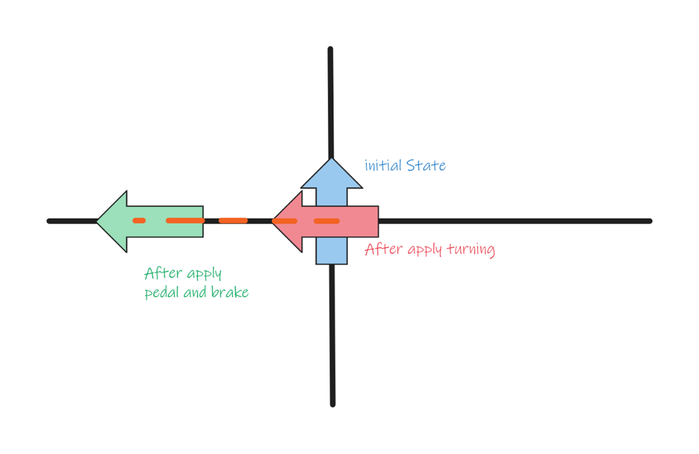

# Rules and Implementation Details

## Bikers and MultiBike Forces

1. **Agent Parameters:**
   - Each agent has three parameters: Pedaling, Braking, and Turning forces.

2. **MegaBike Physics Parameters:**
   - MegaBike parameters for physics engine include Velocity and Orientation.

3. **Orientation Value:**
   - The current value of orientation for MegaBike is referred to as the offset.

4. **Turning Angle Calculation:**
   - The turning angle depends on the TurningDecision.SteeringForce and TurningDecision.SteerBike. If agents do not want to steer, they must set their TurningDecision.SteerBike to false and their steering will not have an impact on the direction of the bike. If an agent does want to steer, they must submit is a force from -1 to 1 which maps to -180° to 180°. This will then be summed with all other agents on the bike who have set TurningDecision.SteerBike to true and averaged to output a new orientation for the bike.

5. **Orientation Update:**
   - The updated Orientation is calculated by adding the Turning Angle to the Offset: `Offset = Offset + Turning Angle`.

6. **Post-Turning Forces Application:**
   - After turning, all the pedaling force and braking force will be applied in the direction of the updated orientation.

7. **Velocity Constraint:**
   - The Velocity will not drop below zero; hence, the bike will not move backwards.
   - The Velocity has a maximum value that it cannot exceed

8. **Drag Force**
   - There is a drag force that is propotional to Velocity squared.

 
